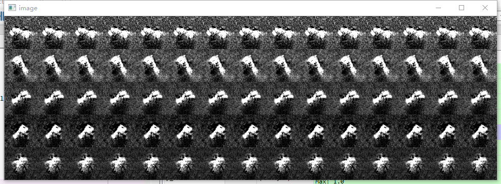
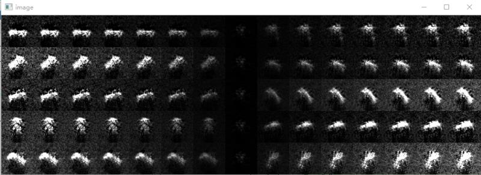

# zero-shot learning 
 classification of SAR images based on variation autoencoder.
the database is get from the mstar which is SAR images of tanks. after the model is trained well, we change one dimension of the latent apace ,we can see the generated image varied as below:

